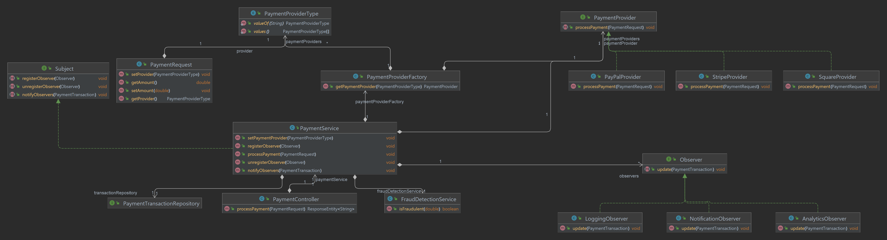

# Payment Service

A Spring Boot microservice for processing payments with different providers (PayPal, Stripe, Square) using the Strategy, Factory, and Observer design patterns. The service validates payment requests, checks for fraudulent transactions, and notifies various components about payment transactions.

## Features

- Process payments through multiple providers.
- Validate payment requests.
- Check for fraudulent transactions.
- Notify logging, analytics, and notification services about payment transactions.
- Use H2 in-memory database for local development.
- Externalize configuration using `application.yml`.

## Technologies Used

- Java 11
- Spring Boot
- Spring Data JPA
- Spring WebFlux
- Spring Validation
- H2 Database
- Maven

## Design Patterns

### Strategy Pattern
Used to define a family of algorithms (payment processing), encapsulate each one, and make them interchangeable. This pattern lets the algorithm vary independently from the clients that use it.

### Factory Pattern
Used to create objects without specifying the exact class of object that will be created. This pattern is used to return the appropriate `PaymentProvider` based on the provider type.

### Observer Pattern
Defines a one-to-many dependency between objects so that when one object changes state, all its dependents are notified and updated automatically. This pattern is used to notify different components (logging, analytics, notifications) about payment transactions.

## Prerequisites

- JDK 11 or higher
- Maven

## Running the Application

### 1. Clone the Repository

```sh
git clone https://github.com/jlassiMo/payment-service.git
cd payment-service
```
### 2\. Configure the Application

Update application.yml with your configuration if needed.

### 3\. Run the Application

```sh
 ./mvnw spring-boot:run   `
```
### 4\. Access the H2 Console

*   Open your browser and go to [http://localhost:8080/h2-console](http://localhost:8080/h2-console)

*   Use the JDBC URL jdbc:h2:mem:testdb, username sa, and leave the password blank.


API Endpoints
-------------

### Process Payment

```sh
 POST /api/payments/process  
```
#### Request Parameters

*   provider: The payment provider (PAYPAL, STRIPE, SQUARE).

*   amount: The amount to be processed.


#### Example Request

```sh
curl -X POST "http://localhost:8080/api/payments/process" -H "Content-Type: application/json" -d '{"provider": "PAYPAL", "amount": 100.0}'

```

Class Descriptions
------------------

### Configuration

#### PaymentProviderProperties.java

*   **Purpose**: Binds external configuration properties from application.yml for payment provider URLs.

*   **Usage**: Provides URLs for PayPal, Stripe, and Square APIs to the respective payment provider classes.


### Controller

#### PaymentController.java

*   **Purpose**: Handles incoming HTTP requests for processing payments.

*   **Endpoints**:

    *   POST /api/payments/process: Processes a payment request.

*   **Usage**: Validates the payment request, sets the payment provider, and processes the payment.


### Exception Handling

#### GlobalExceptionHandler.java

*   **Purpose**: Handles exceptions globally across the application.

*   **Usage**: Provides centralized exception handling to return appropriate HTTP responses for different types of exceptions.


### Model

#### PaymentProviderType.java

*   **Purpose**: Enum representing different payment providers (PAYPAL, STRIPE, SQUARE).

*   **Usage**: Used to identify and select the appropriate payment provider.


#### PaymentRequest.java

*   **Purpose**: Represents a payment request with provider and amount fields.

*   **Validation**: Uses annotations to validate that the provider is not null and the amount is non-negative.

*   **Usage**: Serves as the data transfer object (DTO) for payment requests.


#### PaymentTransaction.java

*   **Purpose**: Represents a payment transaction entity.

*   **Fields**: Includes transaction ID, provider, amount, and success status.

*   **Usage**: Persisted in the database to keep a record of all payment transactions.


### Observer

#### Observer.java

*   **Purpose**: Interface for observer classes that need to be notified of payment transactions.

*   **Method**: update(PaymentTransaction transaction): Updates the observer with transaction details.


#### LoggingObserver.java

*   **Purpose**: Logs payment transaction details.

*   **Method**: update(PaymentTransaction transaction): Logs the transaction.


#### AnalyticsObserver.java

*   **Purpose**: Updates analytics with payment transaction details.

*   **Method**: update(PaymentTransaction transaction): Updates analytics data.


#### NotificationObserver.java

*   **Purpose**: Sends notifications about payment transactions.

*   **Method**: update(PaymentTransaction transaction): Sends a notification.


### Repository

#### PaymentTransactionRepository.java

*   **Purpose**: JPA repository for PaymentTransaction entities.

*   **Usage**: Provides CRUD operations for PaymentTransaction entities.


### Service

#### PaymentService.java

*   **Purpose**: Core service class for processing payments.

*   **Methods**:

    *   setPaymentProvider(PaymentProviderType providerType): Sets the payment provider based on the provider type.

    *   processPayment(double amount): Processes the payment by using the selected provider and saves the transaction.

*   **Pattern**: Implements the Subject interface to notify observers about payment transactions.


#### FraudDetectionService.java

*   **Purpose**: Checks for fraudulent transactions.

*   **Methods**:

    *   isFraudulent(double amount): Returns true if the transaction amount is considered fraudulent.


### Provider

#### PaymentProvider.java

*   **Purpose**: Interface for payment provider classes.

*   **Method**: processPayment(double amount): Processes the payment with the given amount.


#### PaymentProviderFactory.java

*   **Purpose**: Factory class for creating PaymentProvider instances.

*   **Methods**:

    *   getPaymentProvider(PaymentProviderType providerType): Returns the appropriate PaymentProvider based on the provider type.


#### PayPalPaymentProvider.java

*   **Purpose**: Processes payments through PayPal.

*   **Methods**:

    *   processPayment(double amount): Makes an HTTP request to PayPal's API to process the payment.


#### StripePaymentProvider.java

*   **Purpose**: Processes payments through Stripe.

*   **Methods**:

    *   processPayment(double amount): Makes an HTTP request to Stripe's API to process the payment.


#### SquarePaymentProvider.java

*   **Purpose**: Processes payments through Square.

*   **Methods**:

    *   processPayment(double amount): Makes an HTTP request to Square's API to process the payment.


How the Application Works
-------------------------

1.  **Configuration**: application.yml contains configuration for payment provider URLs and database settings.

2.  **Controller**: PaymentController handles incoming payment requests, validates them, and delegates processing to PaymentService.

3.  **Service**:

    *   PaymentService sets the payment provider based on the request and processes the payment.

    *   It checks for fraudulent transactions using FraudDetectionService.

    *   Processes the payment through the selected PaymentProvider.

    *   Saves the transaction in the database H2 using PaymentTransactionRepository.

    *   Notifies registered observers (LoggingObserver, AnalyticsObserver, NotificationObserver) about the transaction.

4.  **Providers**: Different providers (PayPalProvider, StripeProvider, SquareProvider) process payments through their respective APIs.

5.  **Observers**: Observers are notified about the transaction and perform their specific actions (logging, analytics, notifications).

### Class Diagram


[classDiagramPaymentService.drawio.pdf](https://github.com/user-attachments/files/15687190/classDiagramPaymentService.drawio.pdf)
